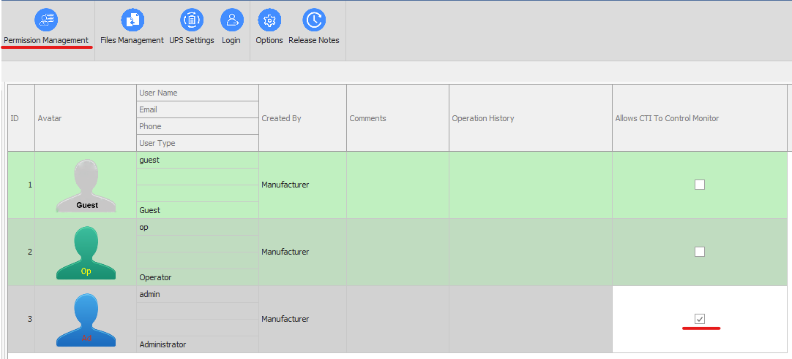
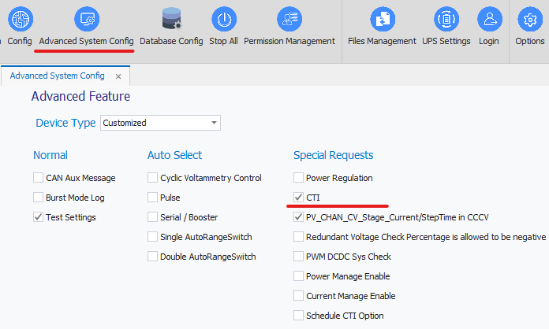

# Fastapi-Demo

<a id="readme-top"></a>

<!-- About The Demo -->

This full-stack demo for **Arbin CTI** shows how to use CTI to achieve the following functions:

- Sign in and sign out.
- Fetch schedule files and test object files.
- Assign schedule files and other necessary files.
- Start a channel.
- Retrieve channel data.

### Built With

- [![React][React.js]][React-url]

- [![Vite][Vite-icon]][Vite-url]

- [![FastAPI][FastAPI-icon]][FastAPI-url]

<!-- Getting Started -->

## Geting Started

Follow the instructions below to set up the project and explore the demo.

### Prerequisites

Ensure you meet the following prerequisties before installation:

1. **Mits Version**: Ensure you install Mits10 with version >= 10.4.2.20-patch.

2. **Permission Management**: Allow users to access CTI in the permission management section.
   

3. **Advanced System Config**: Ensure the **CTI** option under the "special requests" is checked.
   

4. **Python Version**

   _This project is written in Python 3.12.3. To make sure all the dependencies are compatible and can work normally, using Python 3.12.3 is recommanded._

   You can verify your python version by runninng:

   ```sh
   python --version
   ```

   If Python is not installed, you can download it from the [official Python website](https://www.python.org/)

5. **Network Setup**:

- Install the backend on a desktop that has **Mits** installed.
- Ensure the frontend and backend are on the same VLAN.

<p align="right">(<a href="#readme-top">back to top</a>)</p>

### Installation

#### Frontend

1. Install LTS Node.js at [https://nodejs.org/en]

   _Make sure to re-start your terminal before continute._

2. Clone the repo
   ```sh
   git clone https://github.com/Arbin-com/Fastapi-Demo.git
   ```
3. Install NPM packages
   ```sh
   cd frontend
   npm install
   ```
4. launch the frontend
   ```sh
   npm run dev
   ```

#### Backend

1. Activate virtual environment

   _To avoid conflicts with your global environment, it's recommended to use a virtual environment._

   ```sh
   cd backend

   python -m venv venv
   venv\Scripts\activate # Windows
   source venv/bin/activate # MacOS
   ```

   Check which Python interpreter is being used with:

   ```sh
   which python
   ```

   If the virtual environment is activated correctly, the output should display the path to the virtual environment's Python interpreter instead of the system-wide Python.

2. Install the dependency
   ```sh
   pip install -r requirements.txt
   ```
3. Launch the backend server

   ```sh
   uvicorn main:app # localhost Mode

   uvicorn main:app --host 0.0.0.0 --port 8000 # for local & public network access
   ```

   If you want to allow only local network devices, insteand of `0.0.0.0`, use your specific local IP:

   ```sh
   uvicorn main:app --host 192.168.1.100 --port 8000
   ```

   _(Replace `192.168.1.100` with your actual local IP)_

4. Access FastAPI Swagger UI

   _Replace `http://127.0.0.1:8000` with the actual server address where FastAPI is running._

   swagger UI

   ```arduino
   http://127.0.0.1:8000/docs
   ```

   ReDoc UI (alternative)

   ```arduino
   http://127.0.0.1:8000/redoc
   ```

<p align="right">(<a href="#readme-top">back to top</a>)</p>

<!-- Usage -->

## Usage

1. To Sign in, use the pc's ip address where you install the backend.
2. The status of channels, schedule file and test object file will be updated automatically once you re-fresh the whole page

<!-- MARKDOWN LINKS & IMAGES -->
<!-- https://www.markdownguide.org/basic-syntax/#reference-style-links -->

[React.js]: https://img.shields.io/badge/React-20232A?style=for-the-badge&logo=react&logoColor=61DAFB
[React-url]: https://reactjs.org/
[FastAPI-icon]: https://img.shields.io/badge/FastAPI-009688?style=for-the-badge&logo=fastapi&logoColor=white
[FastAPI-url]: https://fastapi.tiangolo.com/
[Vite-icon]: https://img.shields.io/badge/Vite-646CFF?style=for-the-badge&logo=vite&logoColor=white
[Vite-url]: https://vite.dev/
